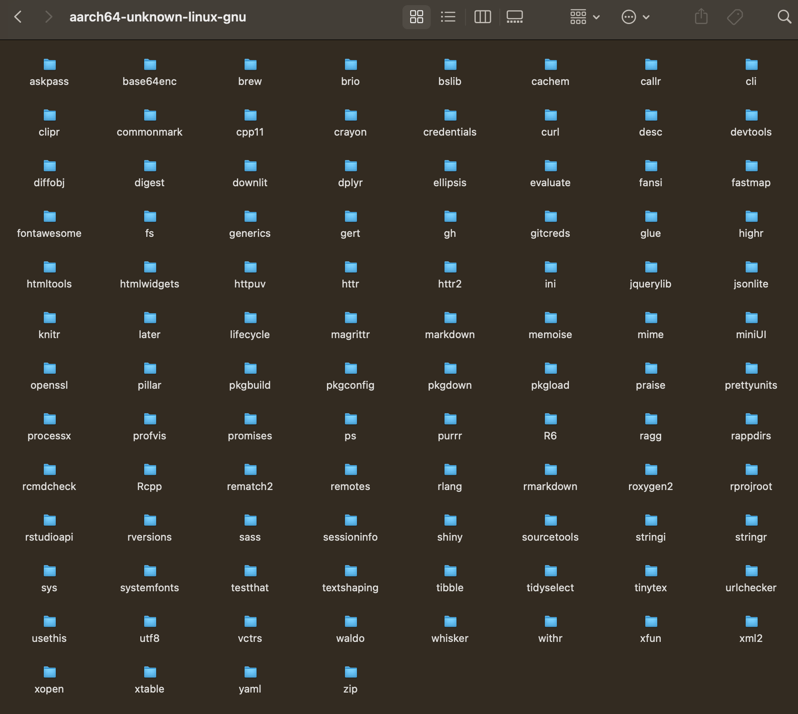
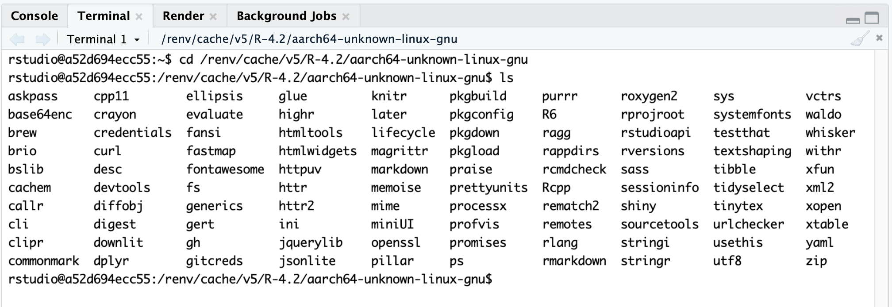

# RStudio Docker Container on Apple M1

I was inspired by [Rami Krispin](https://github.com/RamiKrispin)'s and [Eric Nantz](https://github.com/rpodcast)'s sharing how to do R development in docker environment. In addition to their github repositories, here are some videos that helped me better understand their approaches.

- [R-ladies Tunis Workshop: Introduction to Docker for R users](https://youtu.be/bGwjO07DmAY) by Rami Krispin
- [Fully containerized R dev environment with Docker, RStudio, and VS-Code](https://www.youtube.com/live/4wRiPG9LM3o?feature=share) by Eric Nantz

This repository is to make R development in docker container with RStudio IDE possible in a computer with Apple M1 chip. A year ago, I have never built a docker image by myself, and still I am not an expert. I tried to find a solution in a level that I can understand, and I hope this repository helps other people who try to use docker for R project development.

If you have not used docker before, I think there are many resources out there to learn about docker. A resorce that host helped me was 3-hour tutorial on YouTube: [Docker Tutorial for Beginners](https://youtu.be/3c-iBn73dDE) in *TechWorld with Nana* channel.


## Quick instruction to build docker image & run docker container

### Build docker image

Run the following command in terminal within a folder that Dockerfile is located.

```
docker build . -t rstudio:4.2.2
```

### Edit docker-compose.yml file

Edit docker-compose.yml file with a path in your computer to store r package caches. Please read **Bind host computer directory for renv cache** section below for more details.

```
volumes:
  - type: "bind"
    source: "PLEASE SET YOUR OWN PATH HERE"
    target: "/renv/cache"
```


### Run docker container

Run the following command in terminal within a folder that docker-compose.yml is located.

```
docker compose up -d
```

### Start RStudio

Open web browser (like Safari, Chrome, etc.) and open URL `http://127.0.0.1:8787`

### Stop docker container

When you want to shutdown docker container, run the following command in terminal

```
docker compose down
```


## Background

Rami Krispin highly recommended development in docker container when I asked his advice during rstudio::conf 2022 on how to organize analysis project to be more reproducible and deployable. That was really great advice, and Rami generously shared his practices on his github repository with public access. I really appreciated it! Right after coming back from the conference trip, I tried to follow docker configuration in [Rami Krispin's example](https://github.com/RamiKrispin/ggplot2-graphic-design). On my Apple M1 machine, unfortunately I experienced a couple of major challenges that made me hesitate to immediately switch my development environment to docker container.

1. It did not smoothly work on my Apple M1 machine, so I had to research into how to make dev environment on Apple M1.
2. It took very long time to install R packages in docker. I wanted to make the installation be less time consuming.

I researched into ways to move forward, and I think I found a reasonable stop-gap solution. It took a while for me to figure out what is going on, and I wanted to share the stop-gap solution. I admit that I am not expert in docker, so there may be a better approach to set up dev environment on Apple M1 with RStudio. However, I hope this repository can provide at least "working" solution with some rationale.


## Use rocker/r-ver instead of rocker/rstudio

My Dockerfile is mostly based on approached described by [eitsupi](https://github.com/eitsupi) in [GitHub issue](https://github.com/rocker-org/rocker-versioned2/issues/144#issuecomment-1224978820), with some modification.

[rocker/rstudio:4.2.2](https://hub.docker.com/r/rocker/rstudio/tags?page=1&name=4.2.2) does not support linux/arm64 as of 2023-04-03. Therefore, I used [rocker/r-ver:4.2.2 linux/arm64](https://hub.docker.com/layers/rocker/r-ver/4.2.2/images/sha256-1c3dbc493f550947111dec18face91d719c47603ec01365d687ef04acf19828e?context=explore) as base image and added additional steps that are defined within [rocker/rstudio:4.2.2 linux/amd64](https://hub.docker.com/layers/rocker/rstudio/4.2.2/images/sha256-79fa61b6b9dbaf066914fbd9c380cecffd007439dab126e25ee68d5c266053a9?context=explore) EXCEPT Quarto installation that currently does not seem to support linux/arm64 yet.


## Bind host computer directory for renv cache

I got a hint from [Eric Nantz's setup](https://github.com/rpodcast/r_dev_projects) to bind host computer directory for caching installed packages.

renv cache will allow you to reduce redundant compile of packages that you may use in multiple docker containers. In docker-compose.yml file, bind a path on local (host) computer that cache will be stored to docker directory `/renv/cache`. (Note: In this repository, I hard coded my local directory to simplify the configuration, but it would be better to manage the local path with either separate configuration file or environment variable in hosting computer.)

```
volumes:
  - type: "bind"
    source: "PLEASE SET YOUR OWN PATH HERE"
    target: "/renv/cache"
```

Also, in Dockerfile, the following lines will install renv package and ensure that docker image will use `/renv/cache` as a path of renv cache. 

```
# Set cache path
RUN echo "RENV_PATHS_CACHE=/renv/cache" >> /usr/local/lib/R/etc/Renviron

# Install renv
RUN install2.r -e renv
```

With this docker image and container configuration, when new R package is installed in docker container, it will be cached in your host computer. Below are snapshots of renv cache folder in host computer (i.e. `source` in docker-compose.yml) and in docker container (i.e. `target` in docker-compose.yml) that show the same list of packages.


*renv cache binding source directory in host computer*


*renv cache binding target directory in docker container*

The cache will be used when you need to reinstall the same package (i.e. same version) either within the same docker container or in any other container in the host computer. Installing a package that has not been cached in host machine may take some time, even over than an hour when you install some meta-package like **tidyverse**. The second-time installation, however, will be quick because you would already have the cached package to link.


This simple configuration works well when base image is rocker/r-ver:4.2.2, but it did not work well in earlier version. Detailed explanation is in the following section.


### renv 0.17

rocker/r-ver:4.2.2 linux/arm64 uses Posit Public Package Manager's CRAN snapshot as of 2023-03-14 as repository to download R packages from:

    https://packagemanager.posit.co/cran/__linux__/jammy/2023-03-14

This snapshot has **renv** package versioned `0.17.0`; this version fixed an [issue for linux/arm64 docker image]((https://github.com/rstudio/renv/issues/1132?fbclid=IwAR3w8t-ll6k3sMUdDOg-guX5LY36JxQZiHEOBfWyLlgLP6nw1IUXPGwshOk)). This has also been mentioned in [release note](https://rstudio.github.io/renv/news/index.html#renv-0170):

| *Integration with the RStudio (Posit) Package Manager is now disabled by default on aarch64 Linux instances.*

What this would mean is that for linux/arm64, R package installation through renv will download source file from the repository and install a package from source within docker container. In the past, 0.16 version, downloaded binary package pre-compiled for linux/amd64 and returned an error when loading the package with `library()` function within R session. So, to correctly install R packages, I had to use `type = "source"` to correctly install R packages. From 0.17.0, the default behavior on linux/arm64 has changed, and it installs packages from source. I think this is a reasonable stop-gap solution until Posit Public Package Manager starts to support pre-compiled binary for linux/arm64.

So, I need to install R packages from source within docker container, and this looks a huge downside because it takes a while to install packages. Sometimes, installing some meta-package like **tidyverse** takes well over than an hour. But renv cache can allow you to need to the time consuming installation only once.


### Library required to compile R packages

Each R package has a dependency on different library on linux. From time to time, when you try to install R package, you will get an error because some library has not been installed on docker. This is a moment that you will modify Dockerfile to add script to install missing libraries.

I started with only a couple of libraries.

```
RUN apt-get update && apt-get install -y --no-install-recommends \
    zlib1g-dev \
    libxml2-dev \
    && rm -rf /var/lib/apt/lists/*
```

When I tried to install `devtools`, which is a meta-package, I had to install several additional libraries.

```
# install required library to compile systemfonts package which is a part of devtools package
RUN apt-get update && apt-get install -y libfontconfig1-dev \
    && rm -rf /var/lib/apt/lists/*

# install required library to compile textshaping package which is a part of devtools package
RUN apt-get update && apt-get install -y libharfbuzz-dev libfribidi-dev \
    && rm -rf /var/lib/apt/lists/*

# install required library to compile rang package which is a part of devtools package
RUN apt-get update && apt-get install -y \
    libfreetype6-dev \
    libpng-dev \
    libtiff5-dev \
    libjpeg-dev  \
    && rm -rf /var/lib/apt/lists/*

# install required library to compile gert package which is a part of devtools package
RUN apt-get update && apt-get install -y libgit2-dev \
    && rm -rf /var/lib/apt/lists/*
```


Once you add script to install missing dependencies, rebuilding the docker image and restarting docker container will allow you to install R package that you originally failed due to the missing dependencies.


## Next step: Creating docker image for deployment

This repository explained how to set up development environment. Docker configuration for deployment may need some changes because a host computer on deployment environment may require different binding for renv cache.

I have tested some Dockerfile modification, although it does not exist in this repository. I added scripts to docker image that copy binded host computer directory for renv cache into docker image instead of runtime binding. Afterwards, I also added script in Dockerfile to install R packages through renv. When building the new docker image, the installation used copied cache, so the installation was very quick. I plan to document this additional step next time.


